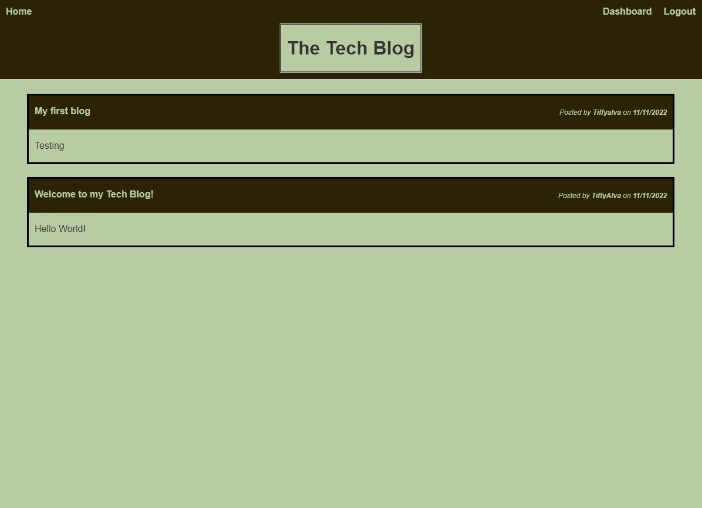

# Tech Blog

## Description:
- This app allows various different users to create an account and post their blog posts. Users can also  delete and edit their own posts. Also, it allows them to comment on posts from others users.

## Heroku Link:

https://tiffyalva-tech-blog.herokuapp.com/

## Table of Contents:
* [Description](#description)
* [Heroku](#heroku-link)
* [Visuals](#visuals)
* [Tools Used](#tools-used)
* [Installation](#installation)
* [Tests](#tests)
* [Contributing](#contributing)
* [License](#license)
* [Information Contacts](#information-contacts)

## Visuals:

- Mock Up

## Tools Used: 
- mysql2
- JavasScript
- CSS
- HTML
- Sequelize
- express-session
- Dotenv
- express-handlebars
- bcrypt
- Node JS

## Installation:
- To install, clone the repo, and run npm install in the terminal to download all the dependecies. 
- Then, run 'npm start' in the terminal to run the application.

## Tests:
- N/A

## Contributing:
- N/A

## License:
 

## Information Contacts:
* GitHub Username: <a href="https://github.com/TiffyAlva">TiffyAlva</a>
* Email: <a href="malito:TiffanyAlvarez54@gmail.com">TiffanyAlvarez54@gmail.com

